 Examen Pratique DevOps – CV One Page

Ce dépôt contient tous les éléments nécessaires pour l'examen pratique DevOps visant à automatiser le déploiement d'une application **CV One Page** avec un pipeline CI/CD complet et la supervision via Grafana Cloud.

---

---
## Structure du dépôt
Examen-Pratique/
│
├─ ansible/
│  ├─ inventories
│  │   │_hosts.ini
│  ├─ playbook.yml
│  └─ roles/
│     ├─ update_upgrade/
│     ├─ docker/
│     ├─ jenkins/
│     └─ terraform/
│_ terraform
│  │_ main.tf
│
│
│
├─ img/
│
├─ cv/
│  ├─ Dockerfile
│  ├─ Jenkinsfile
│  └─ index.html
│
├─ k8s/
│  ├─ deployment.yaml
│  ├─ service.yaml
│
├─ README.md
├─ main.tf

## Préparation de l'environnement

- VM Ubuntu Server 24.04 nommée `DEVOPS-LAB`.  
- Accès par clés SSH depuis la machine locale (clé publique copiée dans `~/.ssh/authorized_keys`).  

- Commande de test SSH :
ssh nour@192.168.56.111

## Automatisation avec Ansible
1. créer roles :
ansible-galaxy init update_upgrade
ansible-galaxy init docker
ansible-galaxy init jenkins
ansible-galaxy init terraform

2. Les rôles Ansible présents dans ansible/ automatisent :

Mise à jour du système (apt update && apt upgrade).

Installation de Docker.

Installation de Terraform.

Installation de Jenkins.

3. commande pour exécuter le playbook :

ansible-playbook -i inventories\hosts.ini playbook.yml
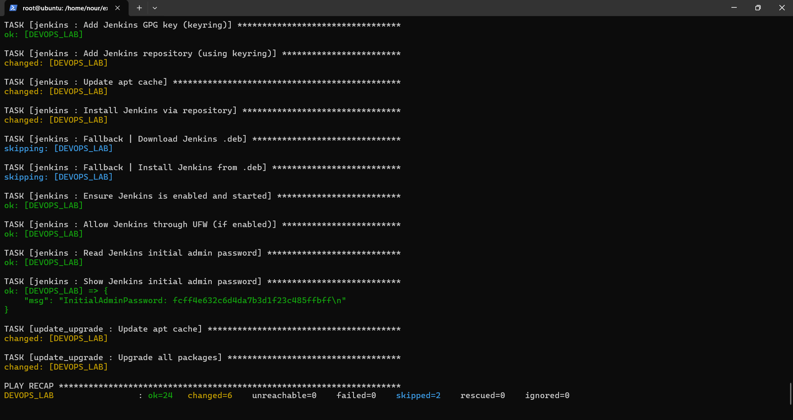
## Pipeline CI/CD avec Jenkins

Récupération du code GitHub : https://github.com/rouissinour464/examen.git
Scrutation automatique toutes les 5 minutes.
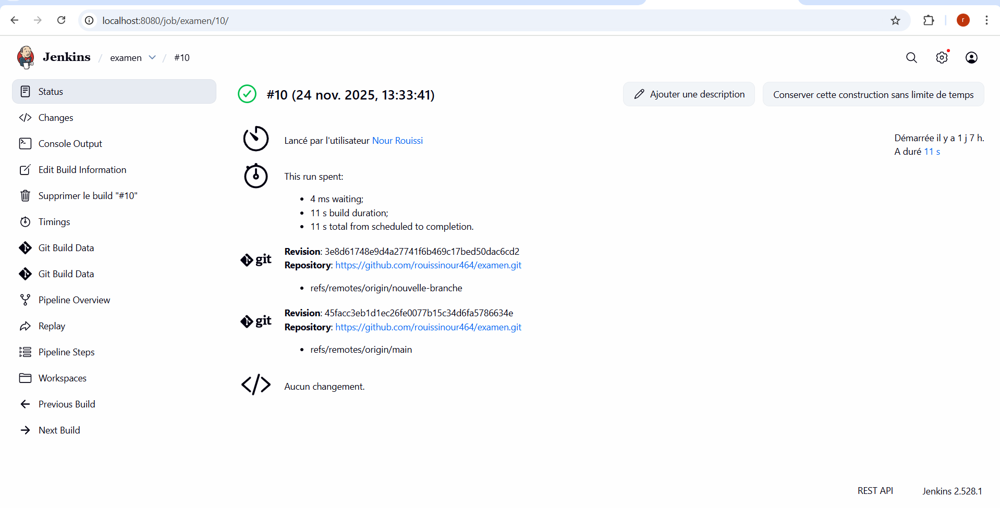
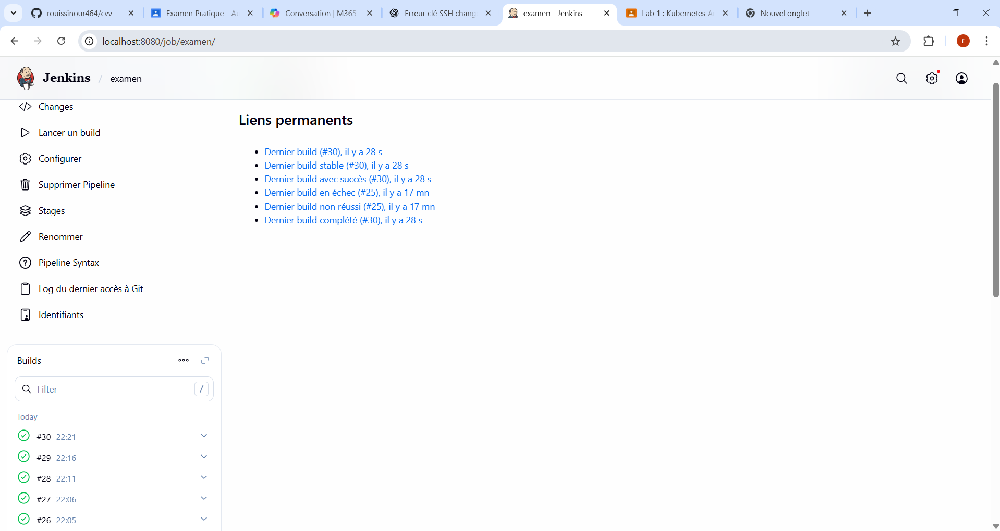
Construction de l'image Docker basée sur Nginx.

Push sur Docker Hub (compte : nour292).

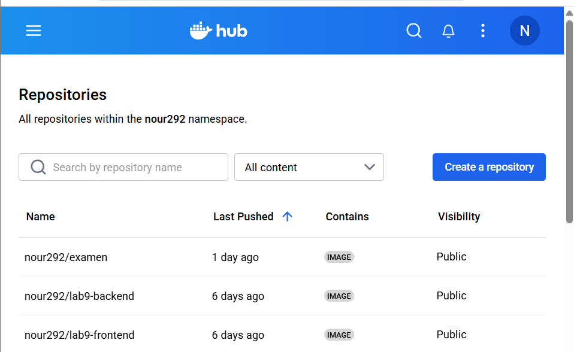

Notification Slack après exécution.

## Déploiement Docker avec Terraform

Terraform déploie un conteneur Docker nommé moncv

1. Ecrire le code (main.tf).
2. Initialiser (terraform init).
3. Planifier (terraform plan).
4. Appliquer (terraform apply).
5. Tester : http://<IP_VM>:8585 .
Test d’accès depuis la machine locale : http://192.168.56.111:8585.

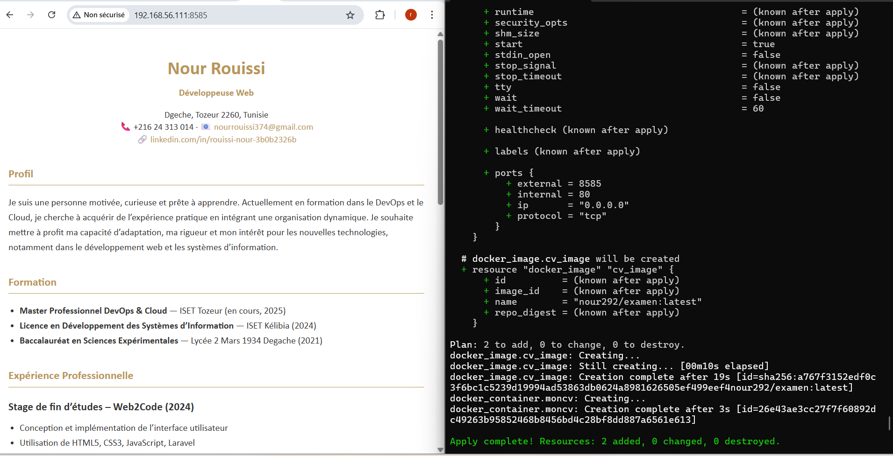

## Orchestration Kubernetes avec K3s et Argo CD

1. Installation K3s Single Node :

curl -sfL https://get.k3s.io | sh -
sudo k3s kubectl get nodes

2. Déploiement via Argo CD :

Path du repo : k8s

Namespace : default

Sync Policy : Automatic

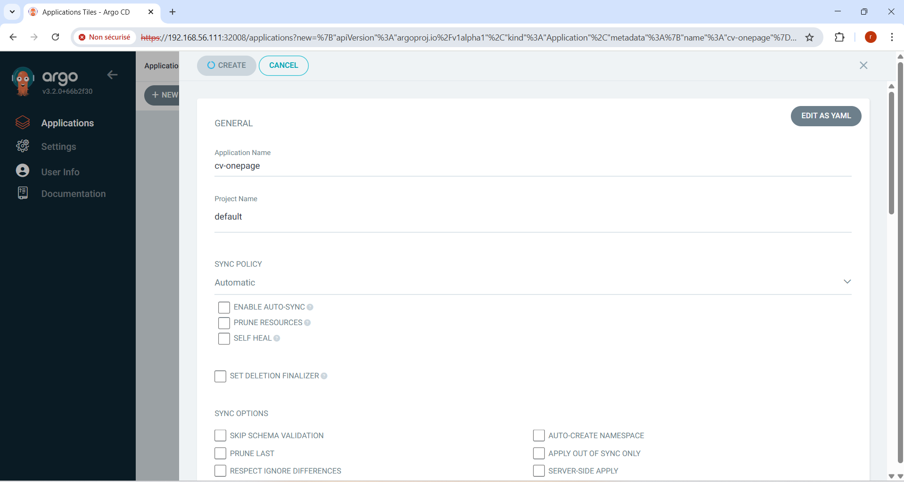

3. Test d’accès : http://192.168.56.111:30085.

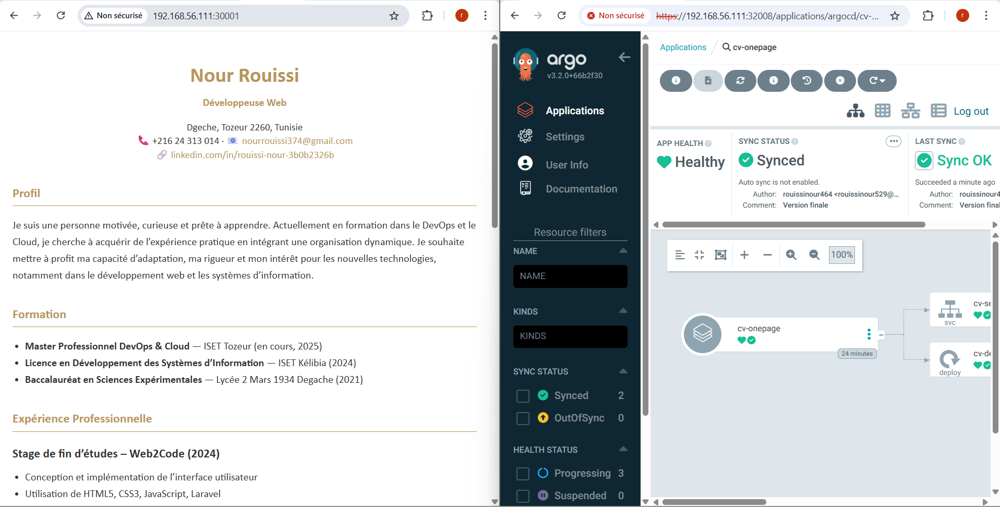

## Supervision et Monitoring avec Grafana Cloud

1. Création d’un compte Grafana Cloud (plan Free).

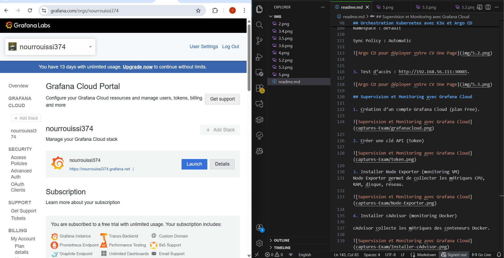

2. Installer Node Exporter (collecte métriques système)

# Télécharger et exécuter node_exporter
sudo useradd --no-create-home --shell /bin/false node_exporter
wget https://github.com/prometheus/node_exporter/releases/download/v1.7.0/node_exporter-1.7.0.linux-amd64.tar.gz
tar xvf node_exporter-1.7.0.linux-amd64.tar.gz
sudo cp node_exporter-1.7.0.linux-amd64/node_exporter /usr/local/bin/

3. Créer un service systemd pour Node Exporter

sudo nano /etc/systemd/system/node_exporter.service

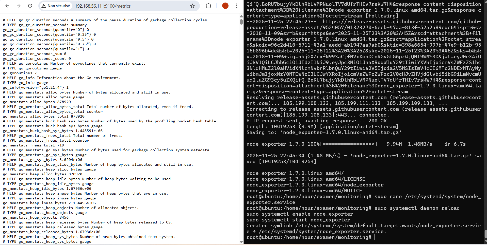
4. Installer Grafana Agent pour envoyer les métriques à Grafana Cloud

# Pour Linux x86_64
wget https://github.com/grafana/agent/releases/download/v0.30.0/grafana-agent-linux-amd64.zip
unzip grafana-agent-linux-amd64.zip
sudo mv grafana-agent-linux-amd64 /usr/local/bin/grafana-agent

5. Surveiller Docker
Installer cAdvisor
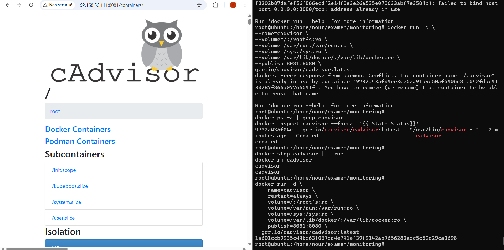
Ajouter cAdvisor dans Grafana Agent
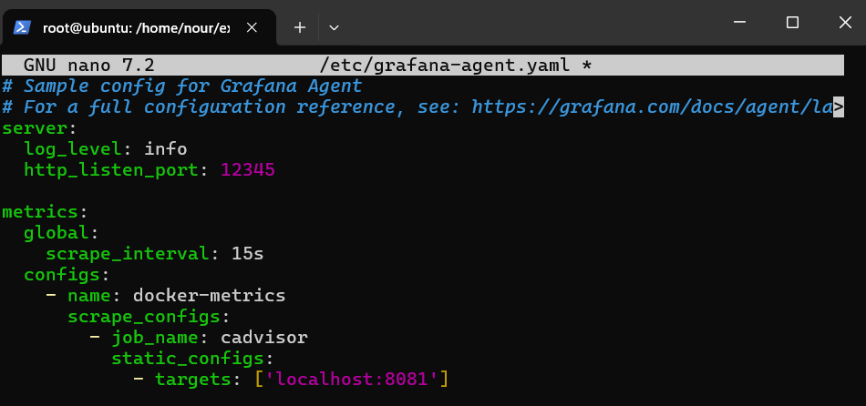
6. Surveiller le cluster Kubernetes (K3S)
Installer kube-prometheus-stack via Helm
Configurer remote_write vers Grafana Cloud
Vérifier que les pods sont prêts
7. Dashboards Grafana Cloud
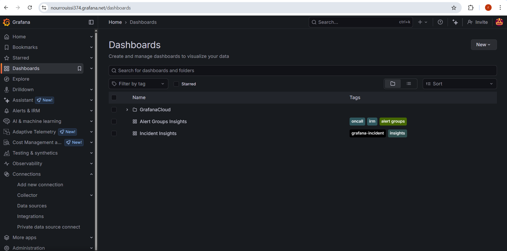
